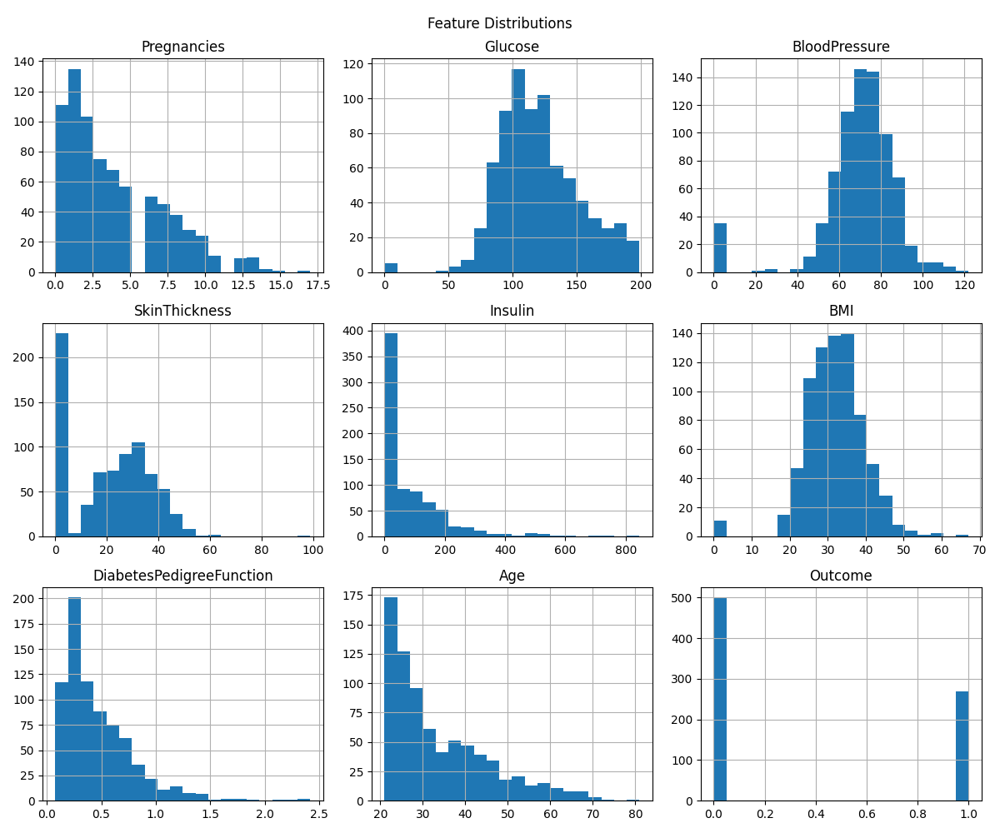
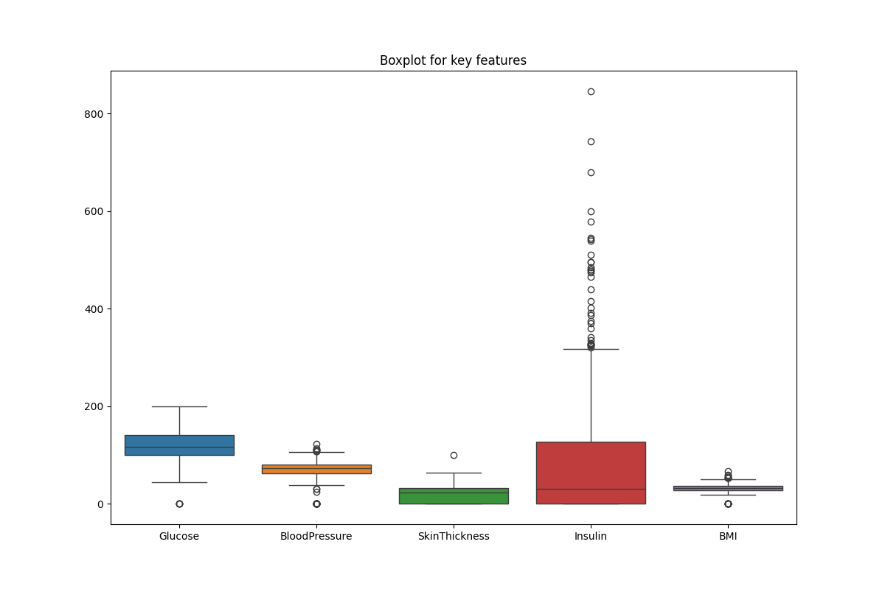
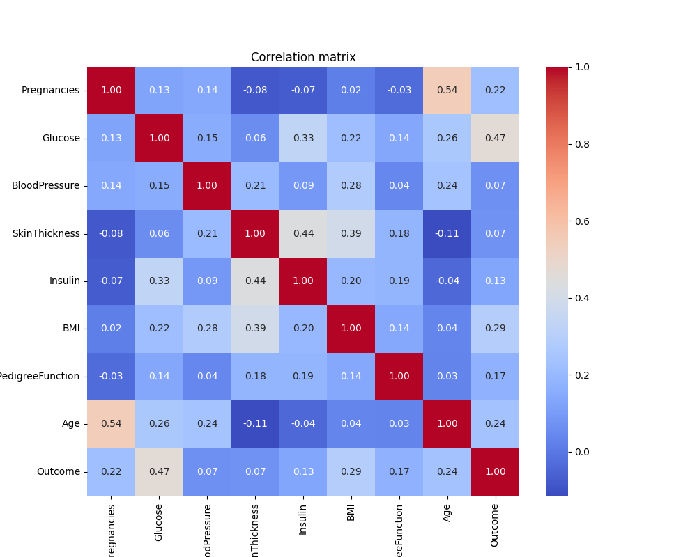
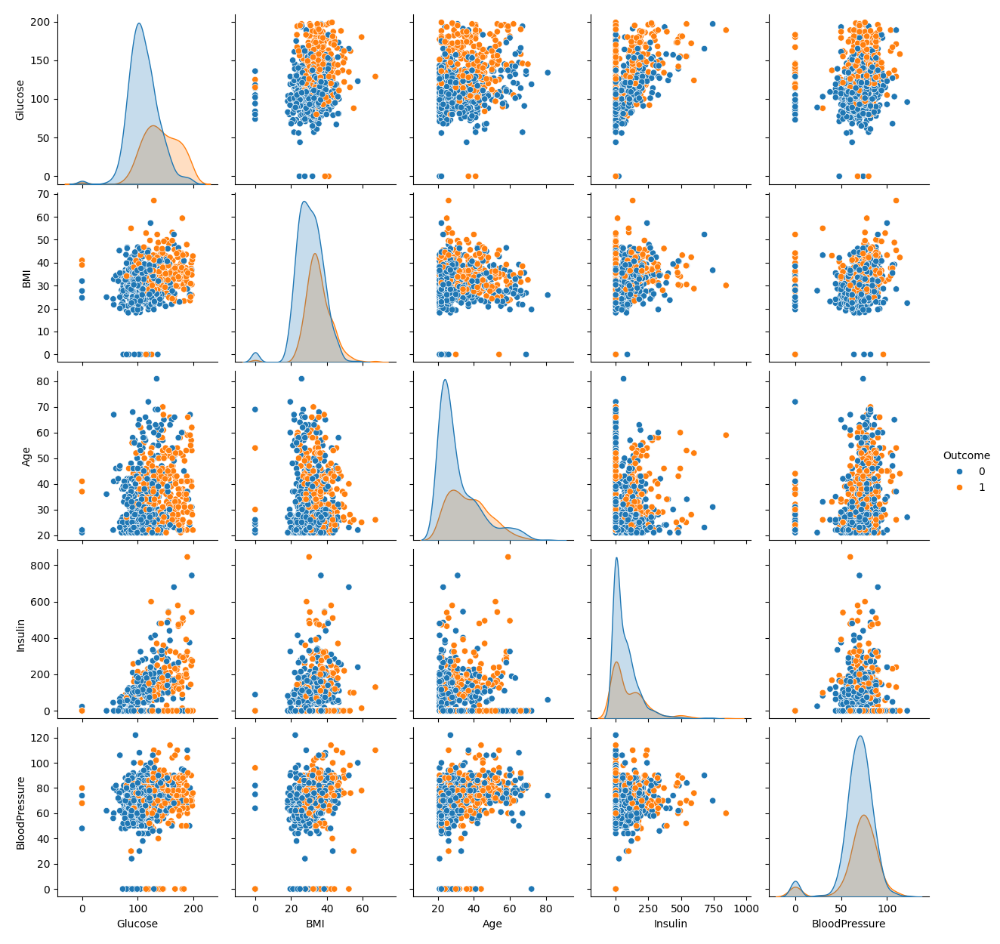
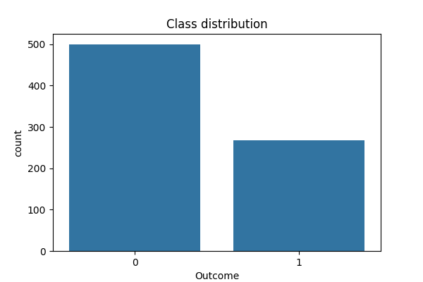

# Diabetes Prediction Using Machine Learning

This repository contains a **clean, modular, and reproducible** machine learning pipeline for predicting diabetes using clinical features.  
The project is designed following **ML best practices**, with proper cross-validation, pipeline-based preprocessing, and model tuning.

---

## 📌 Project Overview

The goal of this project is to predict whether a patient has diabetes based on medical measurements such as glucose level, BMI, age, etc.

Key characteristics of this project:

- No data leakage (scaling is done inside pipelines)
- Proper cross-validation
- Multiple models compared fairly
- Best model selected using **F1-score**
- Hyperparameter tuning applied only to the winning model
- Final model saved for real-world usage

---

## 📊 Dataset

- **File:** `data/diabetes.csv`
- **Source:** Pima Indians Diabetes Dataset
- **Target column:** `Outcome`  
  - `0` → No diabetes  
  - `1` → Diabetes

### Features

| Feature | Description |
|------|-----------|
| Pregnancies | Number of pregnancies |
| Glucose | Plasma glucose concentration |
| BloodPressure | Diastolic blood pressure |
| SkinThickness | Triceps skin fold thickness |
| Insulin | 2-Hour serum insulin |
| BMI | Body mass index |
| DiabetesPedigreeFunction | Diabetes pedigree function |
| Age | Age in years |

---

## 📞 Project Structure

```
ML_Diabets_1404/
│
├── data/
│   └── diabetes.csv
│
├── src/
│   ├── data_loader.py      # Load dataset
│   ├── models.py           # Model pipelines
│   ├── evaluate.py         # Cross-validation metrics
│   ├── tune.py             # Hyperparameter tuning
│   ├── train.py            # Training & model selection
│   ├── predict.py          # Inference script
│   └── visualization.py    # EDA & plots
│
├── models/
│   └── best_model.joblib   # Final trained model
│
├── figures
│   └── plots/              # Auto-saved visualizations
│
├── requirements.txt
└── README.md
```

---

## ⚙️ Installation

Create a virtual environment (recommended):

```bash
python -m venv venv
source venv/bin/activate   # Windows: venv\Scripts\activate
```

Install dependencies:

```bash
pip install -r requirements.txt
```

---

## 🚀 How to Run

### 1️⃣ Exploratory Data Analysis (EDA) & Visualization

Before training, the dataset is explored and visualized to understand feature distributions, relationships, and potential outliers.  

**Key visualizations include:**

- Feature distributions (Histogram / KDE)
- Boxplots to detect outliers
- Correlation heatmap
- Pairplot of key features
- Class distribution  

**Sample visualizations (auto-saved in `plots/` folder):**











---

### 2️⃣ Train and select the best model

```bash
python src/train.py
```

This will:

- Compare multiple models using cross-validation
- Select the best model based on **F1-score**
- Apply hyperparameter tuning to the winning model
- Save the final model to `models/best_model.joblib`

---

### 3️⃣ Make a prediction

```bash
python src/predict.py
```

The prediction script:

- Loads the trained model
- Accepts a sample input as a **pandas DataFrame**
- Outputs prediction and class probabilities

---

## 🧩 Handling Missing Values (Zero Imputation)

Some features (`Glucose`, `BloodPressure`, `SkinThickness`, `Insulin`, `BMI`) contain `0` values considered **missing**.

- Missing values are replaced using **median imputation** inside the pipeline.
- Prevents **data leakage** because the median is computed only from training data.
- Scaling is applied **after imputation** for models sensitive to feature magnitude.

---

## ⚖️ Scaling Strategy

- **Models sensitive to feature scales:** SVM, MLP, KNN, Naive Bayes → `StandardScaler` applied  
- **Tree-based models:** DecisionTree, RandomForest → Scaling not necessary  
- Ensures consistent preprocessing without bias or leakage.

---

## 🧠 Models Used

| Model | Scaling | Notes |
|-------|---------|-------|
| Naive Bayes | Yes | GaussianNB, scale applied due to feature variance |
| KNN | Yes | KNN requires scaling for distance calculation |
| SVM | Yes | Kernel-based model sensitive to scale, class_weight="balanced" |
| DecisionTree | No | Tree-based, scale not needed |
| RandomForest | No | Tree-based, scale not needed, class_weight="balanced" |
| MLP | Yes | Neural network sensitive to scale, hidden_layer_sizes=(64,32) |

---

## 📈 Evaluation Strategy

- **5-Fold Cross-Validation**
- Metrics: Accuracy, F1-score (primary), ROC-AUC
- F1-score is prioritized due to mild class imbalance

---

## 🔍 Hyperparameter Tuning

- Implemented with `GridSearchCV`
- Applied only to the **best-performing model**
- Optimizes F1-score, prevents overfitting

---

## 🛡️ Design Decisions

- Pipelines prevent data leakage
- StandardScaler applied selectively
- Feature names preserved during inference
- Modular, reusable code

---

## 📦 Model Persistence

Final trained model:

```
models/best_model.joblib
```

- Ready for API, web app, or production inference

---

## 🔮 Future Improvements

- Handle class imbalance explicitly (SMOTE / class weights)
- Threshold tuning based on ROC curve
- REST API deployment (FastAPI)
- Model explainability (SHAP)

---

## 📜 License

GPL-3.0 License

---

## 👤 Author

Clean and defensible machine learning implementation prioritizing correctness over superficial results.

